# 🍣 Sushi Sales Dashboard

## 📌 Project Overview
This project demonstrates a complete **data lifecycle**: from storing and querying large-scale transaction data in a **PostgreSQL** database to building an interactive, high-level business dashboard in **Microsoft Excel**.

The objective was to analyze key performance indicators (**KPIs**) and identify trends in customer purchasing behavior, peak order times, and product performance to support **resource optimization** and **inventory management**.

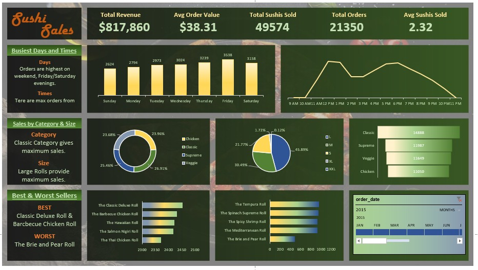
---

## 🛠️ Tools & Technologies Used

| Category | Tools |
|-----------|--------|
| Database | PostgreSQL |
| Analysis | SQL (Window Functions, CTEs, Aggregations) |
| Visualization | Microsoft Excel (Pivot Tables, Advanced Formulas) |
| Automation | Power Query |

---

## 📊 Data Analysis & SQL Queries

The project began by importing raw CSV data into a PostgreSQL environment. Advanced SQL queries were used to calculate key business metrics and validate data integrity before building visualizations.

### Key SQL Findings

- 💰 **Total Revenue:** **$817,860.05**
- 📦 **Total Orders Processed:** **21,350**
- 🍣 **Total Sushi Sold:** **49,574**
- 📈 **Average Order Value:** **$38.31**
- 🛒 **Average Sushi per Transaction:** **2.32**

### SQL KPI Verification

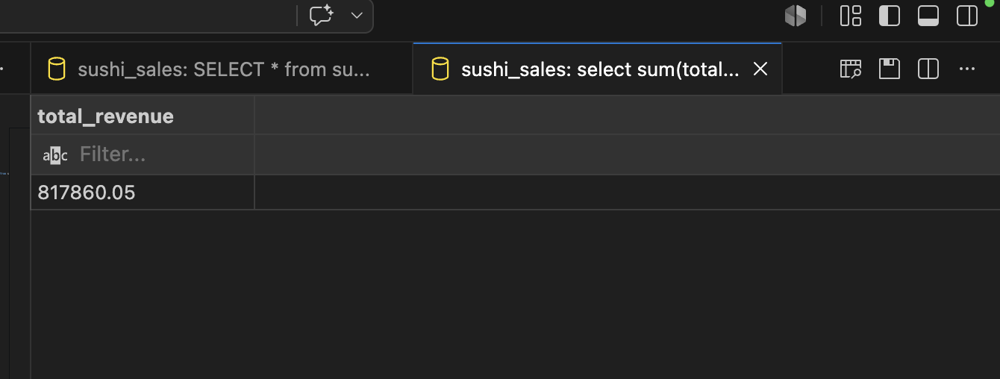

*Figure 1: SQL output for total revenue*

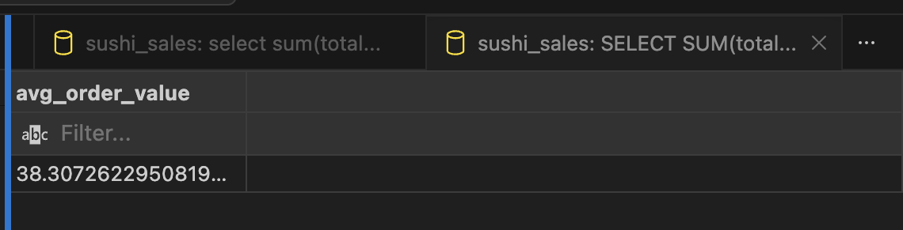

*Figure 2: SQL output for average order value*

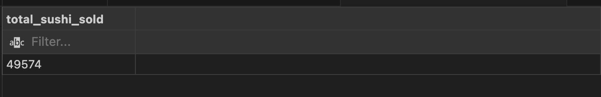

*Figure 3: SQL output for total sushi sold*

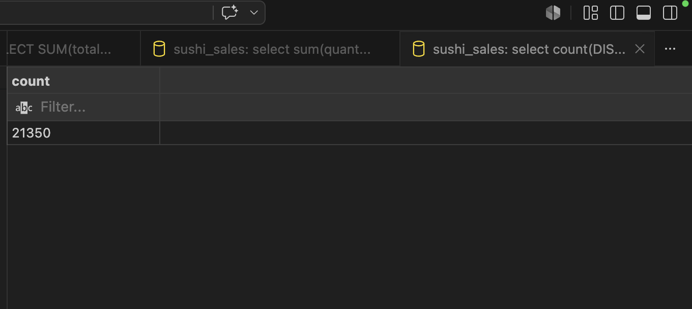

*Figure 4: SQL output for total orders*

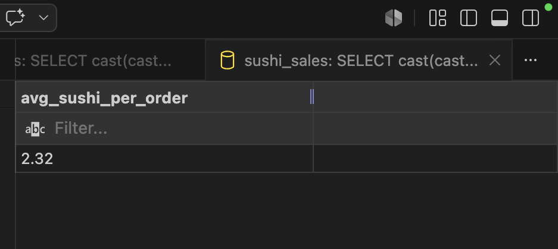

*Figure 5: SQL output for average items per transaction*

---

## 📈 Dashboard Features & Insights

The Excel dashboard provides a comprehensive overview of business performance and enables users to filter and analyze trends across multiple dimensions.

### ⏰ 1. Busiest Days & Times

#### Findings:
- **Friday** recorded the highest order volume (**3,538 orders**)
- Demand remained high on **Saturday**
- Peak ordering hours:
  - **Lunch Rush:** 12 PM – 1 PM
  - **Dinner Rush:** 5 PM – 7 PM

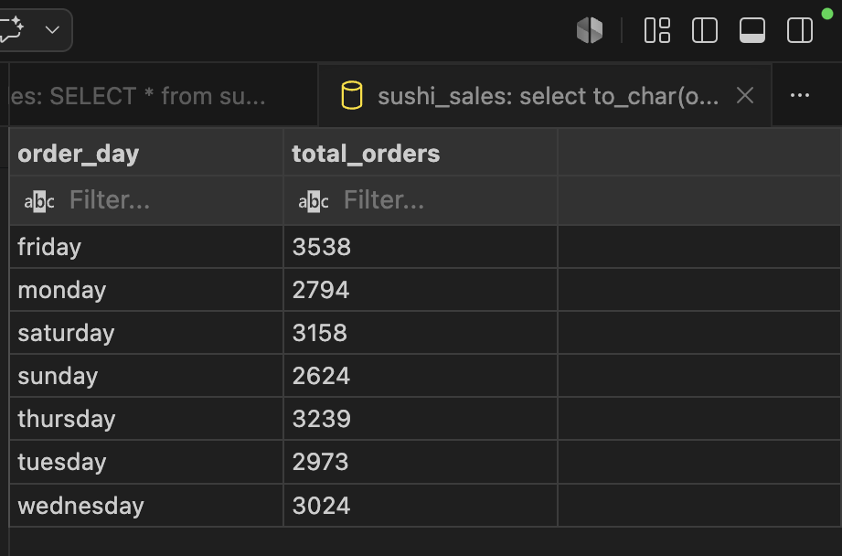

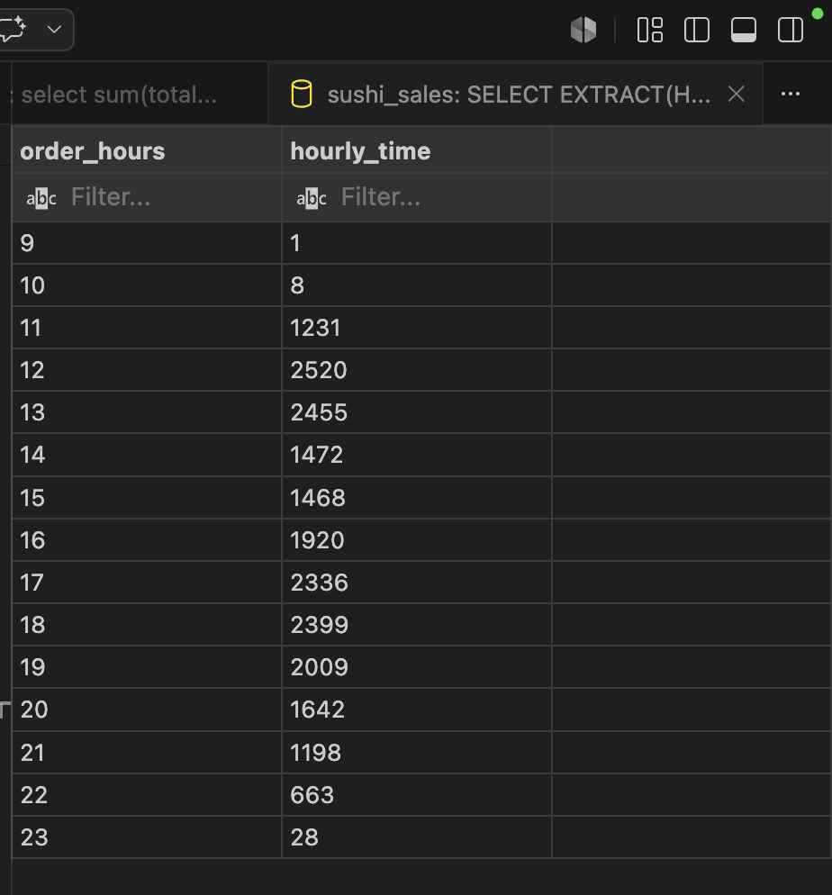

#### Business Insight:
Prioritize staffing and inventory preparation during these high-demand periods.

---

### 🍱 2. Sales by Category & Size

#### Category Performance:
- **Classic category** generated **26.9%** of total sales.

#### Size Performance:
- **Large rolls** were the preferred choice among customers, contributing **45.9%** of total items sold.

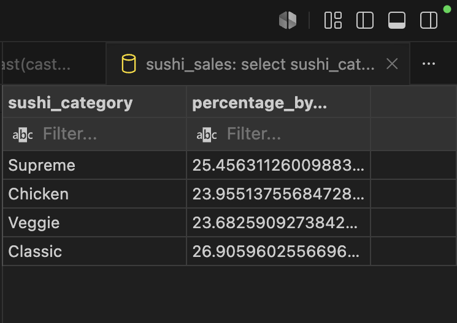

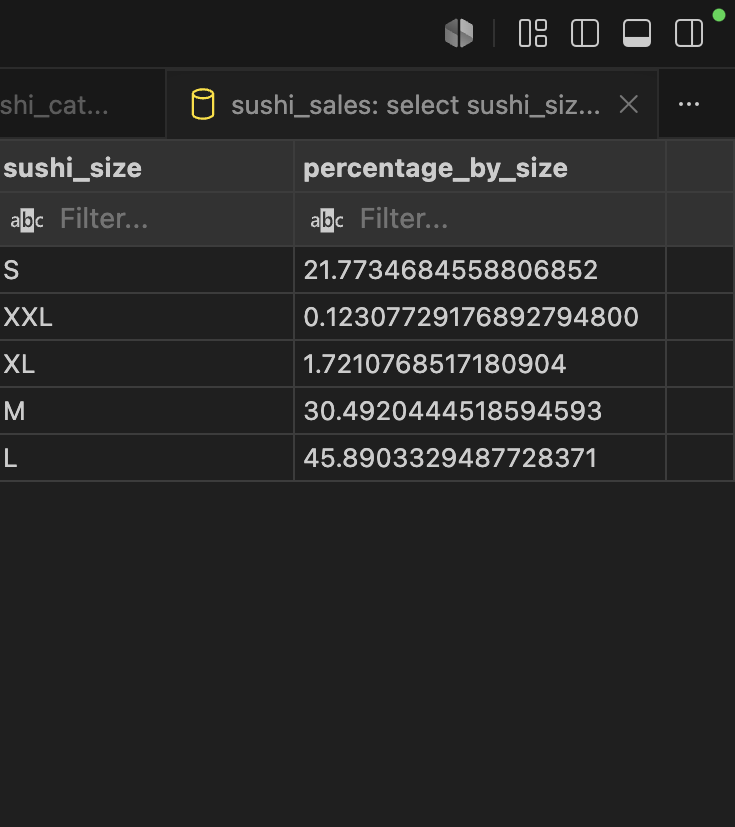

---

### 🏆 3. Best & Worst Sellers

#### Best Sellers:
- Classic Deluxe Roll
- Barbecue Chicken Roll

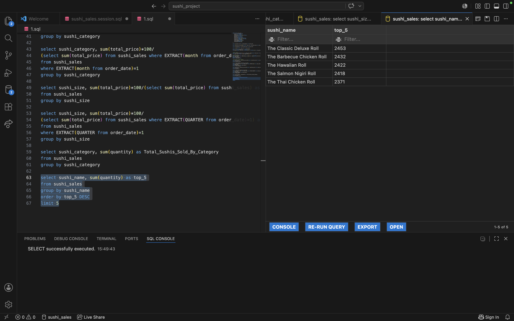

#### Lowest Seller:
- Brie and Pear Roll

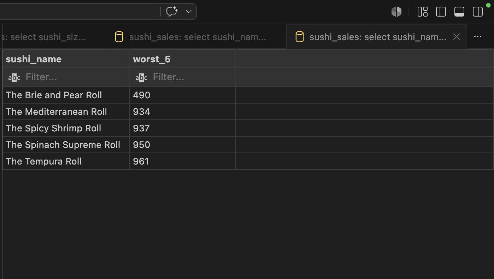

#### Business Insight:
The low performance of the Brie and Pear Roll suggests opportunities for:
- Menu redesign
- Promotional campaigns
- Product replacement analysis

---

## 🚀 Key Learnings

- Built a complete data workflow from raw data ingestion to business insights.
- Strengthened SQL skills through:
  - Common Table Expressions (CTEs)
  - Window Functions
  - Aggregations
- Gained experience with:
  - Data cleaning using Power Query
  - Dashboard design principles
  - KPI analysis and storytelling through data

